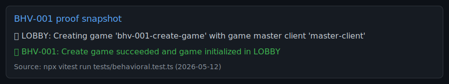

# Behavioral Test Report

Generated: 2026-05-12
Purpose: Comprehensive behavioral test inventory and fill-in template.
Status: Planning template only. Detailed execution results will be added later.

## How To Use This Document

- `Status`: `Planned`, `In Progress`, `Passed`, `Failed`, `Blocked`.
- Display style:
  - **Green** = pass
  - **Red** = fail
  - **Yellow** = warning or issue but generally passed
- Fill each test with:
  - Preconditions
  - Actors
  - Steps
  - Postconditions
  - Special Cases
- Keep test IDs stable (`BHV-###`) so reports and CI references do not drift.

## Test Inventory (Comprehensive)

| ID | Interaction Area | Scenario | Status |
|---|---|---|---|
| [BHV-001](#bhv-001) | Lobby | Create game succeeds with valid game master credentials | **Passed** |
| [BHV-002](#bhv-002) | Lobby | Create game fails when game id already exists | **Passed** |
| [BHV-003](#bhv-003) | Lobby | Join game succeeds with valid key and unique player identity | **Passed** |
| [BHV-004](#bhv-004) | Lobby | Join game fails with wrong key | **Passed** |
| [BHV-005](#bhv-005) | Lobby | Join game fails on duplicate identity constraints (color/tower if enforced) | **Passed** |
| [BHV-006](#bhv-006) | Lobby | Start game succeeds only by game master from lobby | **Passed** |
| [BHV-007](#bhv-007) | Lobby | Start game fails for non-game-master actor | **Passed** |
| [BHV-008](#bhv-008) | Lobby | Start game fails when player count is below minimum | **Passed** |
| [BHV-009](#bhv-009) | Setup | Tower assignment succeeds for active setup player | **Passed** |
| [BHV-010](#bhv-010) | Setup | Tower assignment fails for already-claimed tower | **Passed** |
| [BHV-011](#bhv-011) | Setup | Tower assignment fails for invalid tower tile | **Passed** |
| [BHV-012](#bhv-012) | Setup | Setup completes and transitions to first turn phase | **Passed** |
| [BHV-013](#bhv-013) | Split | Split legion succeeds with legal split | **Passed** |
| [BHV-014](#bhv-014) | Split | Split legion fails when resulting stack size is illegal | **Passed** |
| [BHV-015](#bhv-015) | Split | Split legion fails when actor is not active player | **Passed** |
| [BHV-016](#bhv-016) | Split | Split legion fails outside SPLIT phase | **Passed** |
| [BHV-017](#bhv-017) | Move | Move legion succeeds to legal destination after valid roll | **Passed** |
| [BHV-018](#bhv-018) | Move | Move legion fails when destination is not reachable by roll | **Passed** |
| [BHV-019](#bhv-019) | Move | Move legion fails when no die roll is available | **Passed** |
| [BHV-020](#bhv-020) | Move | Move legion fails when ending on friendly-occupied tile | **Passed** |
| [BHV-021](#bhv-021) | Move/Phase | MOVE ends to RECRUIT when no battle is pending | **Passed** |
| [BHV-022](#bhv-022) | Move/Phase | MOVE ends to FIGHT when a battle is pending | **Passed** |
| [BHV-023](#bhv-023) | Battle Start | Battle is initiated when enemy legions occupy same tile | **Passed** |
| [BHV-024](#bhv-024) | Battle Start | Force-battle setup succeeds for valid attacker/defender/tile | **Passed** |
| [BHV-025](#bhv-025) | Battle Start | Force-battle setup fails for invalid players or invalid tile | **Passed** |
| [BHV-026](#bhv-026) | Battle Resolve | Resolve battle succeeds with attacker victory outcome | **Passed** |
| [BHV-027](#bhv-027) | Battle Resolve | Resolve battle succeeds with defender victory outcome | **Passed** |
| [BHV-028](#bhv-028) | Battle Resolve | Resolve battle succeeds with tie outcome (mutual elimination) | **Passed** |
| [BHV-029](#bhv-029) | Battle Resolve | Resolve battle fails outside FIGHT phase | **Passed** |
| [BHV-030](#bhv-030) | Battle Resolve | Resolve battle fails when tile lacks valid opposing legions | **Passed** |
| [BHV-031](#bhv-031) | Battle Resolve | Resolve battle updates survivors and ownership consistently | **Passed** |
| [BHV-032](#bhv-032) | Battle Resolve | Resolve battle emits/logs battle-resolved payload correctly | **Passed** |
| [BHV-033](#bhv-033) | Battle/Phase | FIGHT transitions correctly after resolution | **Passed** |
| [BHV-034](#bhv-034) | Recruit | Recruit succeeds when terrain and prerequisites are met | **Passed** |
| [BHV-035](#bhv-035) | Recruit | Recruit fails when legion is at max size | **Passed** |
| [BHV-036](#bhv-036) | Recruit | Recruit fails when requested creature is not eligible | **Passed** |
| [BHV-037](#bhv-037) | Recruit | Recruit fails when actor is not active player | **Passed** |
| [BHV-038](#bhv-038) | Recruit/Phase | RECRUIT completion transitions to next turn correctly | **Passed** |
| [BHV-039](#bhv-039) | Turn Flow | End-phase order enforces SPLIT -> MOVE -> FIGHT/RECRUIT -> next SPLIT | **Passed** |
| [BHV-040](#bhv-040) | Turn Flow | Out-of-turn actions are rejected across phases | **Passed** |
| [BHV-041](#bhv-041) | Turn Flow | Wrong-phase actions are rejected for split/move/recruit/resolve-battle | **Passed** |
| [BHV-042](#bhv-042) | Turn Flow | Turn handoff sets correct next active player and resets per-turn markers | **Passed** |
| [BHV-043](#bhv-043) | Rejoin | Rejoin succeeds for known client with correct key before start | **Passed** |
| [BHV-044](#bhv-044) | Rejoin | Rejoin succeeds for known client with correct key after start | **Passed** |
| [BHV-045](#bhv-045) | Rejoin | Rejoin fails for unknown client mapping even with correct key | **Passed** |
| [BHV-046](#bhv-046) | Rejoin | Rejoin fails for wrong key | **Passed** |
| [BHV-047](#bhv-047) | End-to-End | Full happy path from create to completed battle and turn handoff | **Passed** |
| [BHV-048](#bhv-048) | End-to-End | Full guardrail path with invalid action at each phase | **Passed** |
| [BHV-049](#bhv-049) | End-to-End | Multi-turn two-player regression with completed battle and recruit | **Passed** |
| [BHV-050](#bhv-050) | End-to-End | Deterministic replay via forced rolls for stable outcomes | **Passed** |
| [BHV-051](#bhv-051) | Connection | Client disconnects during lobby and rejoins with same client id | **Passed** |
| [BHV-052](#bhv-052) | Connection | Client disconnects during active game and rejoins with same client id | **Passed** |
| [BHV-053](#bhv-053) | Connection | Rejoin from different browser or machine with transferred session identity | **Passed** |
| [BHV-054](#bhv-054) | Connection | Rejoin attempt from different browser or machine without session transfer fails safely | **Passed** |
| [BHV-055](#bhv-055) | Connection | After rejoin, active player permissions and controls are restored correctly | **Passed** |
| [BHV-056](#bhv-056) | Connection | After reconnect, client receives full state sync and can continue turn without divergence | **Passed** |

## Detailed Scenario Specifications

### BHV-001 - Create game succeeds with valid game master credentials
[Back to inventory](#inventory)
- Preconditions: no game with target game id exists.
- Actors: game master.
- Steps: submit create game request with valid game id, key, and client id.
- Postconditions: game state exists in lobby; game master mapping is stored.
- Success criteria: response is non-null and contains created game id and initial lobby state.
- Alternate paths: invalid payload returns validation error.
- Key logs:
  - "📍 LOBBY: Creating game 'bhv-001-create-game' with game master client 'master-client'"
  - "✅ BHV-001: Create game succeeded and game initialized in LOBBY"
- Proof snapshot:
  - 
- Result: **Passed**

### BHV-002 - Create game fails when game id already exists
[Back to inventory](#inventory)
- Preconditions: game with target game id already exists.
- Actors: second game master requestor.
- Steps: submit create game request using duplicate game id.
- Postconditions: original game is unchanged; no replacement game is created.
- Success criteria: operation fails with null or explicit duplicate error.
- Alternate paths: same requester retry with new game id succeeds.
- Key logs:
  - "📍 LOBBY: Attempting duplicate create for game 'bhv-002-duplicate-game'"
  - "✅ BHV-002: Duplicate game create was rejected"
- Proof snapshot:
  - Pending run (backend-only test)
- Result: **Passed**

### BHV-003 - Join game succeeds with valid key and unique player identity
[Back to inventory](#inventory)
- Preconditions: game exists in lobby; join key is known.
- Actors: joining player.
- Steps: submit join game with correct key, unique client identity, player name, color, and requested tower if applicable.
- Postconditions: player appears in game player list.
- Success criteria: join response contains player id and updated game state.
- Alternate paths: different player joins same game and both players remain present.
- Key logs:
  - "📍 LOBBY: Client 'client-1' joining game 'bhv-003-join-valid' with valid key"
  - "✅ BHV-003: Join + player registration succeeded"
- Proof snapshot:
  - Pending run (backend-only test)
- Result: **Passed**

### BHV-004 - Join game fails with wrong key
[Back to inventory](#inventory)
- Preconditions: game exists with configured key.
- Actors: joining player.
- Steps: submit join game with invalid key.
- Postconditions: player is not added; player count unchanged.
- Success criteria: join request returns null or authentication error.
- Alternate paths: same player retries with correct key and succeeds.
- Key logs:
  - "📍 LOBBY: Client 'client-1' attempting join with invalid key"
  - "✅ BHV-004: Invalid key join was rejected"
- Proof snapshot:
  - Pending run (backend-only test)
- Result: **Passed**

### BHV-005 - Join game fails on duplicate identity constraints
[Back to inventory](#inventory)
- Preconditions: game already contains conflicting player identity field if that rule is enforced.
- Actors: second joining player.
- Steps: submit join with duplicate constrained attribute.
- Postconditions: no conflicting player record added.
- Success criteria: operation fails with rule violation.
- Alternate paths: join with unique identity data succeeds.
- Key logs:
  - "📍 LOBBY: Attempting second player add with duplicate color '#FF0000'"
  - "📍 LOBBY: Attempting second player add with duplicate tower '100'"
  - "✅ BHV-005: Duplicate color and tower constraints were enforced"
- Proof snapshot:
  - Pending run (backend-only test)
- Result: **Passed**

### BHV-006 - Start game succeeds only by game master from lobby
[Back to inventory](#inventory)
- Preconditions: game exists in lobby with minimum required players.
- Actors: game master.
- Steps: game master sends start game action.
- Postconditions: phase advances from lobby to setup or split entry phase.
- Success criteria: response includes updated phase and active player state.
- Alternate paths: start action after already started is rejected.
- Key logs:
  - "📍 LOBBY: Game master attempting start from LOBBY"
  - "✅ BHV-006: Game master start transitioned game to SPLIT"
- Proof snapshot:
  - Pending run (backend-only test)
- Result: **Passed**

### BHV-007 - Start game fails for non-game-master actor
[Back to inventory](#inventory)
- Preconditions: game exists in lobby and is startable.
- Actors: non-game-master player.
- Steps: non-master sends start game action.
- Postconditions: game remains in lobby.
- Success criteria: start fails and no phase transition occurs.
- Alternate paths: game master start action then succeeds.
- Key logs:
  - "📍 LOBBY: Non-master attempting start from LOBBY"
  - "✅ BHV-007: Non-game-master start was rejected"
- Proof snapshot:
  - Pending run (backend-only test)
- Result: **Passed**

### BHV-008 - Start game fails when player count is below minimum
[Back to inventory](#inventory)
- Preconditions: lobby has fewer than minimum players.
- Actors: game master.
- Steps: game master sends start game action.
- Postconditions: lobby state unchanged.
- Success criteria: start fails with minimum player validation.
- Alternate paths: add required players then start succeeds.
- Key logs:
  - "📍 LOBBY: Game master attempting start without any players"
  - "✅ BHV-008: Start was rejected because player count is below minimum"
- Proof snapshot:
  - Pending run (backend-only test)
- Result: **Passed**

### BHV-009 - Tower assignment succeeds for active setup player
[Back to inventory](#inventory)
- Preconditions: game in setup; tower is valid and unclaimed.
- Actors: active player in setup.
- Steps: submit assign tower action.
- Postconditions: player has tower assignment and initial legion placement updated.
- Success criteria: response contains assigned tower and updated player state.
- Alternate paths: another valid unclaimed tower assignment succeeds for other players.
- Key logs:
  - "📍 SETUP: Assigning tower 100 to Player 1"
  - "✅ BHV-009: Tower assignment succeeded for setup player"
- Proof snapshot:
  - Pending run (backend-only test)
- Result: **Passed**

### BHV-010 - Tower assignment fails for already-claimed tower
[Back to inventory](#inventory)
- Preconditions: one player already assigned target tower.
- Actors: different setup player.
- Steps: submit assign same tower.
- Postconditions: second player remains unassigned.
- Success criteria: assignment fails and existing owner remains unchanged.
- Alternate paths: second player assigns a different open tower and succeeds.
- Key logs:
  - "📍 SETUP: Player 2 attempting to claim already used tower 100"
  - "✅ BHV-010: Duplicate tower assignment was rejected"
- Proof snapshot:
  - Pending run (backend-only test)
- Result: **Passed**

### BHV-011 - Tower assignment fails for invalid tower tile
[Back to inventory](#inventory)
- Preconditions: game in setup.
- Actors: setup player.
- Steps: submit assign tower with invalid tile id.
- Postconditions: no assignment recorded.
- Success criteria: request fails with validation or rules error.
- Alternate paths: retry with valid tower tile succeeds.
- Key logs:
  - "📍 SETUP: Player 1 attempting to claim invalid tower 999"
  - "✅ BHV-011: Invalid tower assignment was rejected"
- Proof snapshot:
  - Pending run (backend-only test)
- Result: **Passed**

### BHV-012 - Setup completes and transitions to first turn phase
[Back to inventory](#inventory)
- Preconditions: all players except last are assigned towers.
- Actors: final unassigned setup player.
- Steps: final player assigns valid tower.
- Postconditions: setup is complete and game transitions to first turn phase.
- Success criteria: phase changes to split and active player is defined.
- Alternate paths: if one player is still unassigned, phase does not transition.
- Key logs:
  - "📍 SETUP: Final player assigning tower to complete setup"
  - "✅ BHV-012: Setup completion transitioned game to SPLIT"
- Proof snapshot:
  - Pending run (backend-only test)
- Result: **Passed**

### BHV-013 - Split legion succeeds with legal split
[Back to inventory](#inventory)
- Preconditions: active player in split phase with legal source legion.
- Actors: active player.
- Steps: submit split with valid creature partition and legal destination tile for new legion.
- Postconditions: original and new legions exist with legal sizes.
- Success criteria: split response includes both legions and expected creature counts.
- Alternate paths: legal alternative partition also succeeds.
- Key logs:
  - "📍 SPLIT: Splitting 8-creature legion into two legal 4-creature legions"
  - "✅ BHV-013: Legal split created valid original and new legions"
- Proof snapshot:
  - Pending run (backend-only test)
- Result: **Passed**

### BHV-014 - Split legion fails when resulting stack size is illegal
[Back to inventory](#inventory)
- Preconditions: active player in split phase.
- Actors: active player.
- Steps: submit split that leaves one side with illegal creature count.
- Postconditions: no new legion created; original legion unchanged.
- Success criteria: split returns failure.
- Alternate paths: corrected legal split succeeds.
- Key logs:
  - "📍 SPLIT: Attempting split with empty new stack (illegal size)"
  - "✅ BHV-014: Illegal split size was rejected"
- Proof snapshot:
  - Pending run (backend-only test)
- Result: **Passed**

### BHV-015 - Split legion fails when actor is not active player
[Back to inventory](#inventory)
- Preconditions: game in split phase with another player active.
- Actors: non-active player.
- Steps: non-active player submits split.
- Postconditions: state unchanged.
- Success criteria: split rejected due to turn ownership.
- Alternate paths: active player split succeeds.
- Key logs:
  - "📍 SPLIT: Non-active player legion attempting split during active player's turn"
  - "✅ BHV-015: Non-active player split was rejected"
- Proof snapshot:
  - Pending run (backend-only test)
- Result: **Passed**

### BHV-016 - Split legion fails outside split phase
[Back to inventory](#inventory)
- Preconditions: game phase is not split.
- Actors: any player.
- Steps: submit split command.
- Postconditions: state unchanged.
- Success criteria: split rejected due to wrong phase.
- Alternate paths: once phase returns to split, same command can succeed if legal.
- Key logs:
  - "📍 MOVE: Attempting split command outside SPLIT phase"
  - "✅ BHV-016: Split outside SPLIT phase was rejected"
- Proof snapshot:
  - Pending run (backend-only test)
- Result: **Passed**

### BHV-017 - Move legion succeeds to legal destination after valid roll
[Back to inventory](#inventory)
- Preconditions: game in move phase; die roll present; destination reachable.
- Actors: active player.
- Steps: submit move command using legal source and destination.
- Postconditions: legion location updates; moved-legion tracking updates.
- Success criteria: move returns updated game state with legion on destination tile.
- Alternate paths: another legal destination for same roll also succeeds.
- Key logs:
  - "📍 MOVE: Moving legion from 100 to legal tile 312"
  - "✅ BHV-017: Legal move succeeded"
- Proof snapshot:
  - Pending run (backend-only test)
- Result: **Passed**

### BHV-018 - Move legion fails when destination is not reachable by roll
[Back to inventory](#inventory)
- Preconditions: move phase with die roll available.
- Actors: active player.
- Steps: submit move to tile not in valid destinations for roll.
- Postconditions: legion remains at source tile.
- Success criteria: move rejected.
- Alternate paths: move to a valid destination succeeds.
- Key logs:
  - "📍 MOVE: Attempting move to invalid destination 200"
  - "✅ BHV-018: Invalid destination move was rejected"
- Proof snapshot:
  - Pending run (backend-only test)
- Result: **Passed**

### BHV-019 - Move legion fails when no die roll is available
[Back to inventory](#inventory)
- Preconditions: move phase without die roll assigned.
- Actors: active player.
- Steps: attempt move before rolling or forcing roll.
- Postconditions: board state unchanged.
- Success criteria: move rejected due to missing roll.
- Alternate paths: roll first, then move succeeds.
- Key logs:
  - "📍 MOVE: Attempting move before rolling die"
  - "✅ BHV-019: Move without die roll was rejected"
- Proof snapshot:
  - Pending run (backend-only test)
- Result: **Passed**

### BHV-020 - Move legion fails when ending on friendly-occupied tile
[Back to inventory](#inventory)
- Preconditions: destination occupied by same-player legion.
- Actors: active player.
- Steps: submit move ending on friendly stack tile.
- Postconditions: moving legion position unchanged.
- Success criteria: move rejected by friendly occupancy rule.
- Alternate paths: move to empty or enemy tile succeeds.
- Key logs:
  - "📍 MOVE: Attempting move into friendly-occupied tile 312"
  - "✅ BHV-020: Move into friendly stack was rejected"
- Proof snapshot:
  - Pending run (backend-only test)
- Result: **Passed**

### BHV-021 - Move ends to recruit when no battle is pending
[Back to inventory](#inventory)
- Preconditions: move phase complete with no contested tiles.
- Actors: active player.
- Steps: end phase from move.
- Postconditions: next phase is recruit.
- Success criteria: phase equals recruit.
- Alternate paths: if a contested tile exists, phase should become fight instead.
- Key logs:
  - "📍 MOVE: Ending MOVE with no contested tiles"
  - "✅ BHV-021: MOVE ended in RECRUIT with no pending battle"
- Proof snapshot:
  - Pending run (backend-only test)
- Result: **Passed**

### BHV-022 - Move ends to fight when a battle is pending
[Back to inventory](#inventory)
- Preconditions: move phase complete with at least one contested tile.
- Actors: active player.
- Steps: end phase from move.
- Postconditions: next phase is fight.
- Success criteria: phase equals fight.
- Alternate paths: if contested state is cleared, transition should go to recruit.
- Key logs:
  - "📍 MOVE: Ending MOVE while tile 211 has opposing legions"
  - "✅ BHV-022: MOVE ended in FIGHT due to pending battle"
- Proof snapshot:
  - Pending run (backend-only test)
- Result: **Passed**

### BHV-023 - Battle is initiated when enemy legions occupy same tile
[Back to inventory](#inventory)
- Preconditions: two opposing legions are placed on one tile after move.
- Actors: active mover and defending player.
- Steps: complete move into enemy and end move phase.
- Postconditions: battle context is established for the contested tile.
- Success criteria: phase enters fight and battle participants are detectable.
- Alternate paths: if no enemy on tile, no battle context is created.
- Key logs:
  - "📍 MOVE: Ending MOVE with opposing legions on tile 211"
  - "✅ BHV-023: Battle started when enemy legions shared a tile"
- Proof snapshot:
  - Pending run (backend-only test)
- Result: **Passed**

### BHV-024 - Force-battle setup succeeds for valid attacker, defender, and tile
[Back to inventory](#inventory)
- Preconditions: game exists with both players and valid target tile.
- Actors: admin or test harness action path.
- Steps: invoke force battle setup with valid player ids and tile.
- Postconditions: both legions positioned at battle tile; phase is fight.
- Success criteria: response includes phase fight and selected battle tile.
- Alternate paths: use another valid battle tile and still succeed.
- Key logs:
  - "📍 FIGHT: Forcing battle on tile 211 with valid players"
  - "✅ BHV-024: Force battle succeeded and game entered FIGHT"
- Proof snapshot:
  - Pending run (backend-only test)
- Result: **Passed**

### BHV-025 - Force-battle setup fails for invalid players or invalid tile
[Back to inventory](#inventory)
- Preconditions: game exists.
- Actors: admin or test harness action path.
- Steps: invoke force battle with invalid player id or invalid tile.
- Postconditions: no forced repositioning occurs.
- Success criteria: request fails with null or validation error.
- Alternate paths: correcting invalid input yields success.
- Key logs:
  - "📍 FIGHT: Attempting force battle with invalid defender and invalid tile"
  - "✅ BHV-025: Invalid force battle requests were rejected"
- Proof snapshot:
  - Pending run (backend-only test)
- Result: **Passed**

### BHV-026 - Resolve battle succeeds with attacker victory outcome
[Back to inventory](#inventory)
- Preconditions: game in fight phase with valid opposing legions on battle tile.
- Actors: battle resolver actor.
- Steps: submit resolve battle payload where attacker survives and defender loses all.
- Postconditions: defender legion removed; attacker survives; battle closed.
- Success criteria: response winner is attacker and game state reflects removal of defender.
- Alternate paths: attacker may survive with full or partial remaining creatures.
- Key logs:
  - "📍 FIGHT: Resolving battle with attacker survivors and zero defender survivors"
  - "✅ BHV-026: Battle resolved with attacker victory"
- Proof snapshot:
  - Pending run (backend-only test)
- Result: **Passed**

### BHV-027 - Resolve battle succeeds with defender victory outcome
[Back to inventory](#inventory)
- Preconditions: game in fight with valid battle tile.
- Actors: battle resolver actor.
- Steps: submit resolve battle payload where defender survives and attacker loses all.
- Postconditions: attacker legion removed; defender survives.
- Success criteria: response winner is defender and board cleanup is correct.
- Alternate paths: defender survives with variable remaining size.
- Key logs:
  - "📍 FIGHT: Resolving battle with defender survivors and zero attacker survivors"
  - "✅ BHV-027: Battle resolved with defender victory"
- Proof snapshot:
  - Pending run (backend-only test)
- Result: **Passed**

### BHV-028 - Resolve battle succeeds with tie outcome
[Back to inventory](#inventory)
- Preconditions: game in fight with valid battle tile.
- Actors: battle resolver actor.
- Steps: submit resolve battle payload with both sides eliminated.
- Postconditions: both legions removed from battle tile.
- Success criteria: response indicates tie and no battle legion remains on tile.
- Alternate paths: if one side still has units, tie outcome is rejected.
- Key logs:
  - "📍 FIGHT: Resolving battle with no survivors on either side"
  - "✅ BHV-028: Battle resolved as tie"
- Proof snapshot:
  - Pending run (backend-only test)
- Result: **Passed**

### BHV-029 - Resolve battle fails outside fight phase
[Back to inventory](#inventory)
- Preconditions: game not in fight phase.
- Actors: battle resolver actor.
- Steps: submit resolve battle request.
- Postconditions: no unit or phase changes.
- Success criteria: request returns failure.
- Alternate paths: switching to fight phase allows valid resolution.
- Key logs:
  - "📍 RECRUIT: Attempting resolve battle outside FIGHT phase"
  - "✅ BHV-029: Resolve battle outside FIGHT was rejected"
- Proof snapshot:
  - Pending run (backend-only test)
- Result: **Passed**

### BHV-030 - Resolve battle fails when tile lacks valid opposing legions
[Back to inventory](#inventory)
- Preconditions: fight phase but target tile has missing or non-opposing participants.
- Actors: battle resolver actor.
- Steps: resolve battle on invalid tile context.
- Postconditions: state unchanged.
- Success criteria: resolve fails.
- Alternate paths: resolve on valid contested tile succeeds.
- Key logs:
  - "📍 FIGHT: Attempting resolve with missing opposing legion on battle tile"
  - "✅ BHV-030: Resolve failed for invalid opposing legion state"
- Proof snapshot:
  - Pending run (backend-only test)
- Result: **Passed**

### BHV-031 - Resolve battle updates survivors and ownership consistently
[Back to inventory](#inventory)
- Preconditions: valid fight resolution context.
- Actors: battle resolver actor.
- Steps: resolve battle with explicit survivor sets.
- Postconditions: remaining creatures in surviving legion match submitted survivors.
- Success criteria: survivor counts and creature identities align exactly with result payload.
- Alternate paths: partial survivor sets are accepted when legal.
- Key logs:
  - "📍 FIGHT: Resolving battle with two attacker survivors"
  - "✅ BHV-031: Survivor composition and ownership stayed consistent"
- Proof snapshot:
  - Pending run (backend-only test)
- Result: **Passed**

### BHV-032 - Resolve battle emits or logs battle resolved payload correctly
[Back to inventory](#inventory)
- Preconditions: valid battle resolution executed.
- Actors: battle resolver actor and observers.
- Steps: resolve battle and inspect event or log channel.
- Postconditions: battle resolved event log entry exists with game id, tile, and winner metadata.
- Success criteria: emitted payload fields match resulting game state.
- Alternate paths: failed resolutions do not emit success payload.
- Key logs:
  - "✅ BHV-032: Battle resolved log payload captured expected details"
- Proof snapshot:
  - Pending run (backend-only test)
- Result: **Passed**

### BHV-033 - Fight transitions correctly after resolution
[Back to inventory](#inventory)
- Preconditions: fight phase with one or more pending battles.
- Actors: active player.
- Steps: resolve one battle, then end phase as required by engine flow.
- Postconditions: game transitions to recruit if no pending battles; otherwise remains fight.
- Success criteria: phase reflects pending battle status.
- Alternate paths: multiple battles force repeated fight handling.
- Key logs:
  - "📍 FIGHT: Resolving battle and checking resulting phase"
  - "✅ BHV-033: Successful battle resolution transitioned to RECRUIT"
- Proof snapshot:
  - Pending run (backend-only test)
- Result: **Passed**

### BHV-034 - Recruit succeeds when terrain and prerequisites are met
[Back to inventory](#inventory)
- Preconditions: recruit phase; legion has room and meets terrain chain prerequisites.
- Actors: active player.
- Steps: submit recruit with eligible creature type.
- Postconditions: legion gains one creature of recruited type.
- Success criteria: recruit response is non-null and creature appears in legion.
- Alternate paths: recruiting different eligible creature also succeeds.
- Key logs:
  - "📍 RECRUIT: Recruiting TROLL in MARSH with required OGRE chain"
  - "✅ BHV-034: Legal recruit succeeded"
- Proof snapshot:
  - Pending run (backend-only test)
- Result: **Passed**

### BHV-035 - Recruit fails when legion is at max size
[Back to inventory](#inventory)
- Preconditions: recruit phase; legion at size cap.
- Actors: active player.
- Steps: submit recruit for otherwise eligible creature.
- Postconditions: legion size unchanged at cap.
- Success criteria: recruit is rejected.
- Alternate paths: reducing size before recruit allows success.
- Key logs:
  - "📍 RECRUIT: Attempting recruit with legion already at size 7"
  - "✅ BHV-035: Recruit at max size was rejected"
- Proof snapshot:
  - Pending run (backend-only test)
- Result: **Passed**

### BHV-036 - Recruit fails when requested creature is not eligible
[Back to inventory](#inventory)
- Preconditions: recruit phase with legion below cap.
- Actors: active player.
- Steps: request recruit for creature not in eligible set for current terrain and stack.
- Postconditions: no creature added.
- Success criteria: recruit request fails.
- Alternate paths: request eligible creature succeeds.
- Key logs:
  - "📍 RECRUIT: Attempting ineligible recruit HYDRA on PLAINS"
  - "✅ BHV-036: Ineligible recruit was rejected"
- Proof snapshot:
  - Pending run (backend-only test)
- Result: **Passed**

### BHV-037 - Recruit fails when actor is not active player
[Back to inventory](#inventory)
- Preconditions: recruit phase with another player active.
- Actors: non-active player.
- Steps: non-active player submits recruit action.
- Postconditions: no recruitment occurs.
- Success criteria: request rejected by turn ownership rule.
- Alternate paths: active player recruit succeeds.
- Key logs:
  - "📍 RECRUIT: Non-active player attempting recruit"
  - "✅ BHV-037: Non-active player recruit was rejected"
- Proof snapshot:
  - Pending run (backend-only test)
- Result: **Passed**

### BHV-038 - Recruit completion transitions to next turn correctly
[Back to inventory](#inventory)
- Preconditions: active player has completed recruit opportunities.
- Actors: active player.
- Steps: end phase from recruit.
- Postconditions: next player becomes active and phase resets to split.
- Success criteria: active player changes and phase equals split.
- Alternate paths: in single-player cases, active player may remain same while phase cycles.
- Key logs:
  - "📍 RECRUIT: Ending RECRUIT to rotate turn to next player"
  - "✅ BHV-038: End RECRUIT transitioned to next player's SPLIT"
- Proof snapshot:
  - Pending run (backend-only test)
- Result: **Passed**

### BHV-039 - End-phase order enforces split to move to fight or recruit to next split
[Back to inventory](#inventory)
- Preconditions: playable game with at least two players.
- Actors: active player.
- Steps: advance through end phase actions over one full turn.
- Postconditions: phase order follows rule-defined sequence.
- Success criteria: observed phase sequence matches expected order.
- Alternate paths: branch to fight occurs only when pending battle exists.
- Key logs:
  - "📍 TURN: Advancing through SPLIT -> MOVE -> RECRUIT -> next SPLIT"
  - "✅ BHV-039: Phase order is enforced correctly"
- Proof snapshot:
  - Pending run (backend-only test)
- Result: **Passed**

### BHV-040 - Out-of-turn actions are rejected across phases
[Back to inventory](#inventory)
- Preconditions: known active player and non-active player available.
- Actors: non-active player.
- Steps: attempt split, move, recruit, or resolve actions while non-active.
- Postconditions: game state remains unchanged for each attempt.
- Success criteria: every out-of-turn action is rejected.
- Alternate paths: same actions by active player follow normal success or phase rules.
- Key logs:
  - "📍 SPLIT: Non-active player attempting split"
  - "📍 MOVE: Non-active player attempting move"
  - "📍 RECRUIT: Non-active player attempting recruit"
  - "✅ BHV-040: Out-of-turn actions were rejected across phases"
- Proof snapshot:
  - Pending run (backend-only test)
- Result: **Passed**

### BHV-041 - Wrong-phase actions are rejected for split, move, recruit, resolve battle
[Back to inventory](#inventory)
- Preconditions: game in one concrete phase.
- Actors: active player.
- Steps: submit actions that belong to other phases.
- Postconditions: no illegal cross-phase effect occurs.
- Success criteria: each wrong-phase action fails.
- Alternate paths: correct action for current phase succeeds.
- Key logs:
  - "📍 PHASE: Attempted split, move, recruit, resolve in wrong phases"
  - "✅ BHV-041: Wrong-phase actions were rejected"
- Proof snapshot:
  - Pending run (backend-only test)
- Result: **Passed**

### BHV-042 - Turn handoff sets next active player and resets per-turn markers
[Back to inventory](#inventory)
- Preconditions: current player reaches end of turn.
- Actors: active player then next player.
- Steps: complete turn and transition to next player.
- Postconditions: active player changes correctly and turn-local trackers are reset.
- Success criteria: next player can begin split with clean turn state.
- Alternate paths: with two players, handoff alternates deterministically.
- Key logs:
  - "📍 RECRUIT: Ending turn and checking active player handoff + marker reset"
  - "✅ BHV-042: Turn handoff and per-turn marker reset succeeded"
- Proof snapshot:
  - Pending run (backend-only test)
- Result: **Passed**

### BHV-043 - Rejoin succeeds for known client with correct key before start
[Back to inventory](#inventory)
- Preconditions: lobby game exists with known client mapping.
- Actors: known client.
- Steps: submit rejoin with correct key and client id.
- Postconditions: rejoin response includes player mapping and game state snapshot.
- Success criteria: request succeeds and maps to original player id.
- Alternate paths: same behavior for game master and non-master known clients.
- Key logs:
  - "📍 LOBBY: Known client attempting rejoin before game start"
  - "✅ BHV-043: Known client rejoin succeeded before start"
- Proof snapshot:
  - Pending run (backend-only test)
- Result: **Passed**

### BHV-044 - Rejoin succeeds for known client with correct key after start
[Back to inventory](#inventory)
- Preconditions: started game exists with known client mapping.
- Actors: known client.
- Steps: submit rejoin with correct key.
- Postconditions: response returns current in-progress game phase and player mapping.
- Success criteria: rejoin is successful and state snapshot is current.
- Alternate paths: rejoin during different phases still succeeds.
- Key logs:
  - "📍 SPLIT: Known client attempting rejoin after game start"
  - "✅ BHV-044: Known client rejoin succeeded after start"
- Proof snapshot:
  - Pending run (backend-only test)
- Result: **Passed**

### BHV-045 - Rejoin fails for unknown client mapping even with correct key
[Back to inventory](#inventory)
- Preconditions: game exists and key is correct; client id not mapped.
- Actors: unknown client.
- Steps: submit rejoin request.
- Postconditions: no new mapping created by rejoin path alone.
- Success criteria: request fails.
- Alternate paths: unknown client may still join via normal join path if allowed.
- Key logs:
  - "📍 SPLIT: Unknown client attempting rejoin with correct key"
  - "✅ BHV-045: Unknown client rejoin was rejected"
- Proof snapshot:
  - Pending run (backend-only test)
- Result: **Passed**

### BHV-046 - Rejoin fails for wrong key
[Back to inventory](#inventory)
- Preconditions: game exists with known client mapping.
- Actors: known client.
- Steps: submit rejoin with incorrect key.
- Postconditions: mapping unchanged and no state returned.
- Success criteria: request fails authentication.
- Alternate paths: retry with correct key succeeds.
- Key logs:
  - "📍 LOBBY: Known client attempting rejoin with wrong key"
  - "✅ BHV-046: Wrong-key rejoin was rejected"
- Proof snapshot:
  - Pending run (backend-only test)
- Result: **Passed**

### BHV-047 - Full happy path from create to completed battle and turn handoff
[Back to inventory](#inventory)
- Preconditions: none.
- Actors: game master and second player.
- Steps: create game, join players, start, assign towers, split, move to engage, resolve battle, recruit, end turn.
- Postconditions: one completed battle exists in logs and turn advances to next player.
- Success criteria: all actions in sequence succeed with valid phase transitions.
- Alternate paths: same flow with defender victory also valid.
- Key logs:
  - "✅ BHV-047: Full happy path completed successfully"
- Proof snapshot:
  - Pending run (backend-only test)
- Result: **Passed**

### BHV-048 - Full guardrail path with invalid action at each phase
[Back to inventory](#inventory)
- Preconditions: started two-player game.
- Actors: active and non-active players.
- Steps: in each phase, run one invalid action first, then valid action.
- Postconditions: invalid action causes no state mutation; valid action progresses flow.
- Success criteria: all invalid actions rejected and all follow-up valid actions succeed.
- Alternate paths: include wrong actor and wrong phase invalid variants.
- Key logs:
  - "📍 GUARDRAIL: Invalid-first then valid action pattern succeeded across phases"
  - "✅ BHV-048: Guardrail flow validated invalid and valid paths"
- Proof snapshot:
  - Pending run (backend-only test)
- Result: **Passed**

### BHV-049 - Multi-turn two-player regression with completed battle and recruit
[Back to inventory](#inventory)
- Preconditions: two-player game with deterministic move controls available.
- Actors: both players.
- Steps: execute at least two full turns including one battle and one successful recruit.
- Postconditions: phase cycle remains stable and game state remains internally consistent across turns.
- Success criteria: no deadlocks; turns alternate correctly; battle and recruit outcomes persist.
- Alternate paths: repeat with swapped player order for battle winner.
- Key logs:
  - "✅ BHV-049: Multi-turn flow completed with battle and recruit"
- Proof snapshot:
  - Pending run (backend-only test)
- Result: **Passed**

### BHV-050 - Deterministic replay via forced rolls for stable outcomes
[Back to inventory](#inventory)
- Preconditions: deterministic roll control is available.
- Actors: both players or test harness.
- Steps: run identical scenario twice with same forced rolls and actions.
- Postconditions: resulting state snapshots are equivalent on key fields.
- Success criteria: both runs produce same winner, phase outcomes, and critical board state.
- Alternate paths: changing one roll changes only expected downstream branches.
- Key logs:
  - "📍 REPLAY: Ran deterministic scenario twice with identical forced flow"
  - "✅ BHV-050: Deterministic replay produced stable outcomes"
- Proof snapshot:
  - Pending run (backend-only test)
- Result: **Passed**

## Connection Tests (Disconnect and Rejoin)

### BHV-051 - Client disconnects during lobby and rejoins with same client id
[Back to inventory](#inventory)
- Preconditions: game in lobby; player joined with known client id.
- Actors: same player client reconnecting after disconnect.
- Steps: disconnect socket; reconnect with same client id; issue rejoin.
- Postconditions: player mapping is preserved and lobby state is visible.
- Success criteria: rejoin succeeds and player identity is unchanged.
- Alternate paths: multiple reconnect attempts with same id remain idempotent.
- Key logs:
  - "📍 LOBBY: Rejoining in lobby with same known client id"
  - "✅ BHV-051: Lobby rejoin with same client id succeeded"
- Proof snapshot:
  - Pending run (backend-only test)
- Result: **Passed**

### BHV-052 - Client disconnects during active game and rejoins with same client id
[Back to inventory](#inventory)
- Preconditions: game started; player has active mapping and at least one legion.
- Actors: same player client reconnecting after disconnect.
- Steps: disconnect during non-lobby phase; reconnect with same client id; issue rejoin.
- Postconditions: current phase, player mapping, and game snapshot are restored.
- Success criteria: rejoin succeeds and game state continuity is preserved.
- Alternate paths: rejoin in SPLIT, MOVE, RECRUIT, and FIGHT all return valid snapshot.
- Key logs:
  - "📍 MOVE: Rejoining active game state with same known client id"
  - "✅ BHV-052: Active-game rejoin with same client id succeeded"
- Proof snapshot:
  - Pending run (backend-only test)
- Result: **Passed**

### BHV-053 - Rejoin from different browser or machine with transferred session identity
[Back to inventory](#inventory)
- Preconditions: player disconnected; secure transfer token or equivalent session identity is available.
- Actors: player on a different browser or machine.
- Steps: establish new socket from second device; present transferred identity; request rejoin.
- Postconditions: new connection is bound to existing player identity.
- Success criteria: rejoin succeeds on second device without creating duplicate player.
- Alternate paths: old connection remains disconnected or is superseded by new connection.
- Key logs:
  - "📍 SPLIT: Rejoining from second device context with transferred client identity"
  - "✅ BHV-053: Rejoin with transferred identity succeeded"
- Proof snapshot:
  - Pending run (backend-only test)
- Result: **Passed**

### BHV-054 - Rejoin from different browser or machine without session transfer fails safely
[Back to inventory](#inventory)
- Preconditions: player disconnected; second device has no transferred identity.
- Actors: player on a different browser or machine.
- Steps: connect from second device and attempt rejoin using only game id and key.
- Postconditions: unauthorized remap is prevented.
- Success criteria: rejoin fails with safe error and no player mapping corruption.
- Alternate paths: when proper identity transfer is supplied, rejoin succeeds.
- Key logs:
  - "📍 SPLIT: Rejoin attempt from unknown client id without identity transfer"
  - "✅ BHV-054: Rejoin without transferred identity was rejected safely"
- Proof snapshot:
  - Pending run (backend-only test)
- Result: **Passed**

### BHV-055 - After rejoin, active player permissions and controls are restored correctly
[Back to inventory](#inventory)
- Preconditions: player reconnects successfully during a turn-sensitive phase.
- Actors: rejoined player and non-active player.
- Steps: attempt phase action from rejoined player and from non-active player.
- Postconditions: only rightful active player actions are accepted.
- Success criteria: authorization behavior after rejoin matches pre-disconnect behavior.
- Alternate paths: if rejoined player is non-active, privileged actions remain blocked.
- Key logs:
  - "📍 SPLIT: Validating active-vs-non-active permissions after rejoin"
  - "✅ BHV-055: Post-rejoin permissions match active-player rules"
- Proof snapshot:
  - Pending run (backend-only test)
- Result: **Passed**

### BHV-056 - After reconnect, client receives full state sync and can continue turn without divergence
[Back to inventory](#inventory)
- Preconditions: reconnect occurs mid-game with mutable board state.
- Actors: rejoined client and server.
- Steps: reconnect and rejoin; verify state snapshot; perform next legal action.
- Postconditions: action outcome matches authoritative server state and no divergent client assumptions remain.
- Success criteria: resumed turn continues correctly using rehydrated state.
- Alternate paths: stale local cache is replaced by server snapshot on rejoin.
- Key logs:
  - "📍 MOVE: Rejoin, read synced state, and perform next legal move"
  - "✅ BHV-056: State sync and continued turn action succeeded after reconnect"
- Proof snapshot:
  - Pending run (backend-only test)
- Result: **Passed**

## Execution Buckets

Suggested implementation order for confidence and fast feedback:

1. Must-have core flow (BHV-001 to BHV-023, BHV-026 to BHV-031, BHV-033 to BHV-042, BHV-047, BHV-049)
2. Should-have resilience (BHV-024, BHV-025, BHV-032, BHV-043 to BHV-046, BHV-048, BHV-050)
3. Connection continuity and session transfer (BHV-051 to BHV-056)
4. Optional refinements (new edge-case scenarios discovered during implementation)
