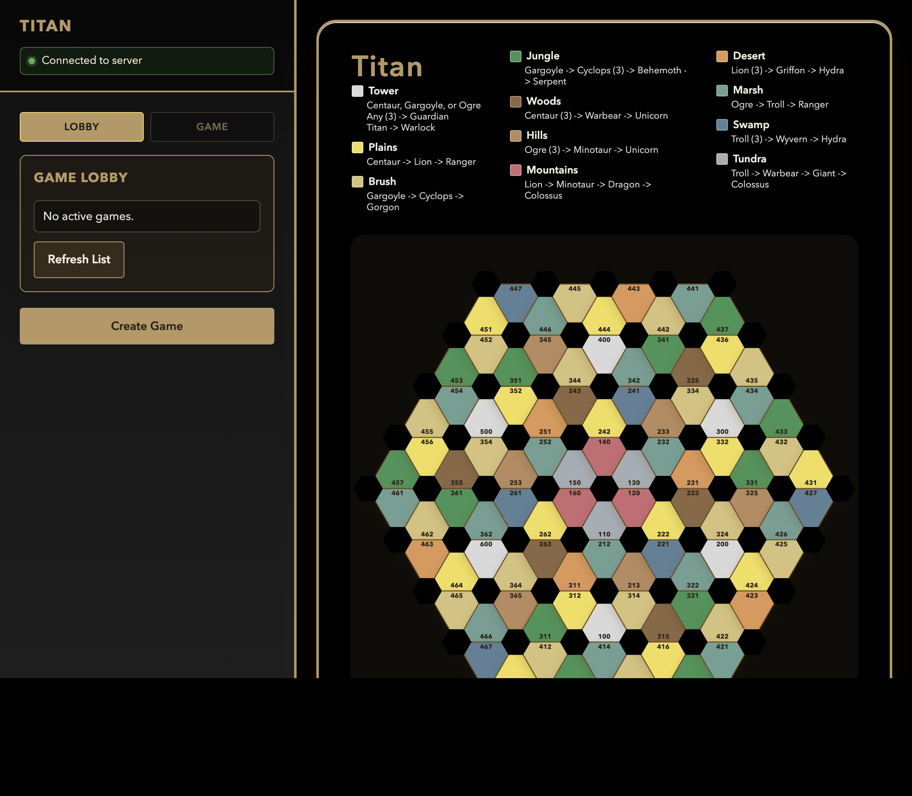
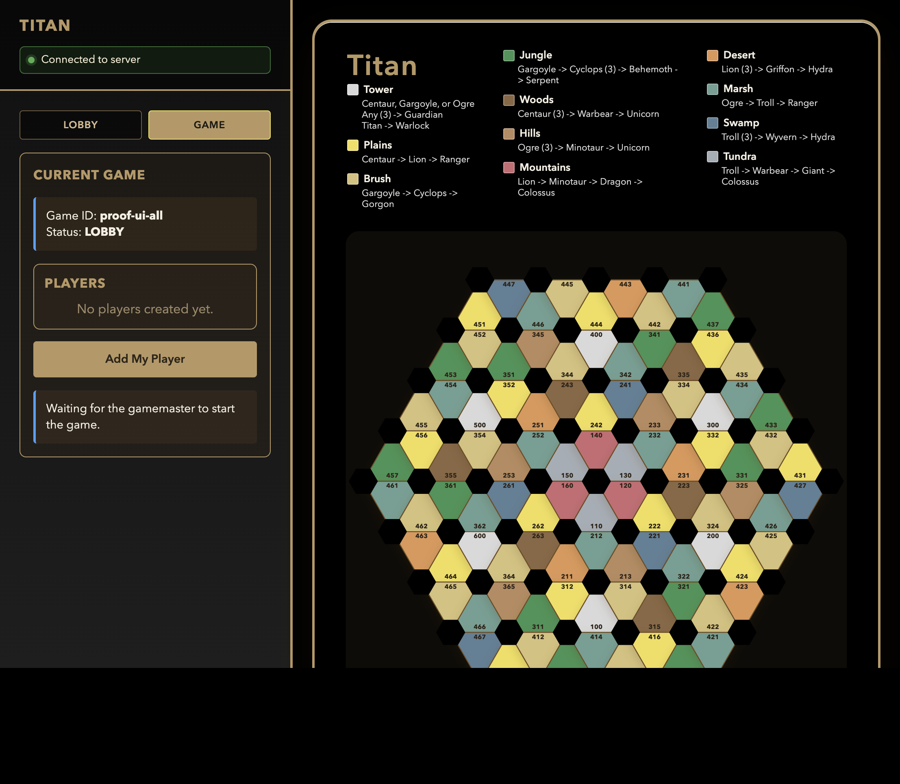
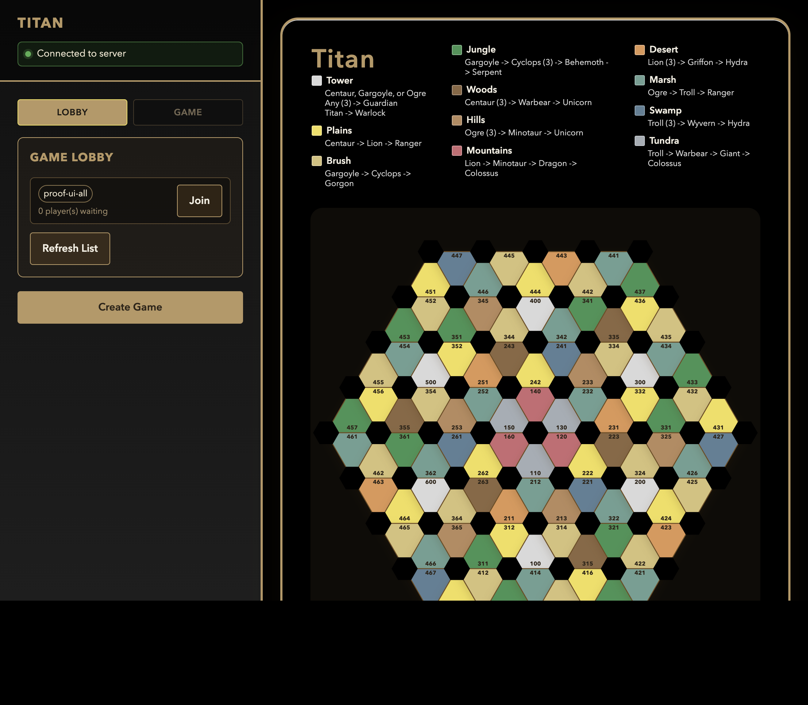
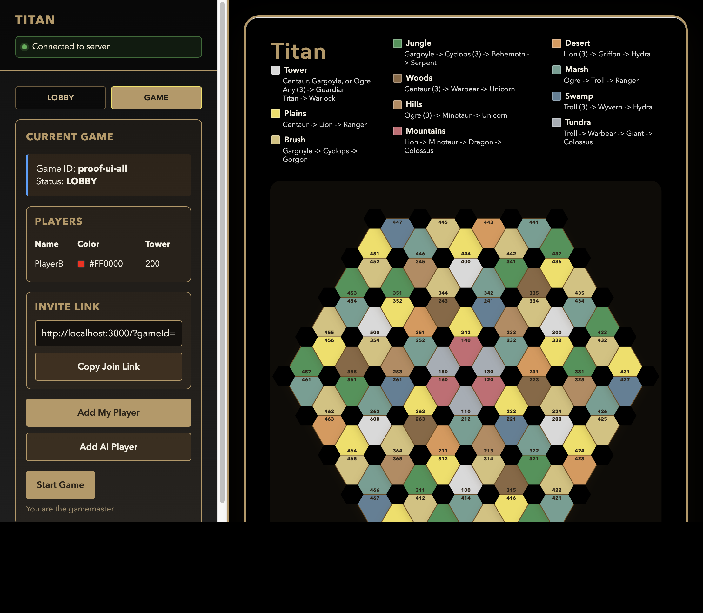
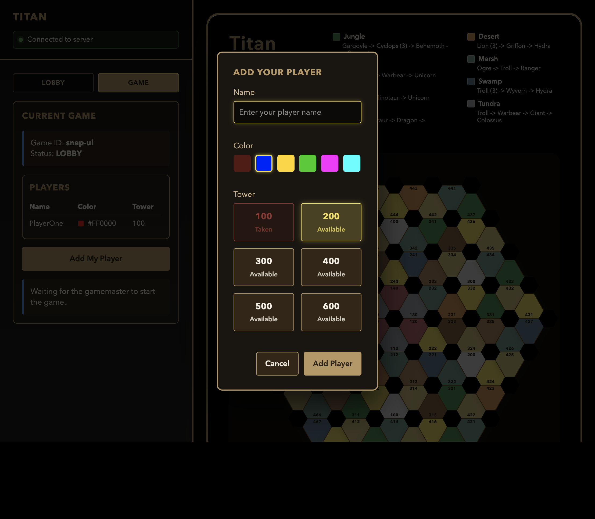
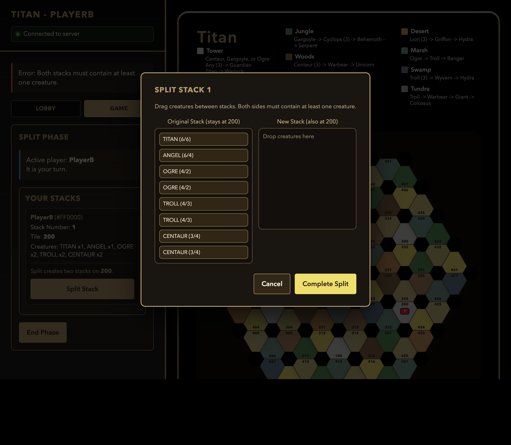
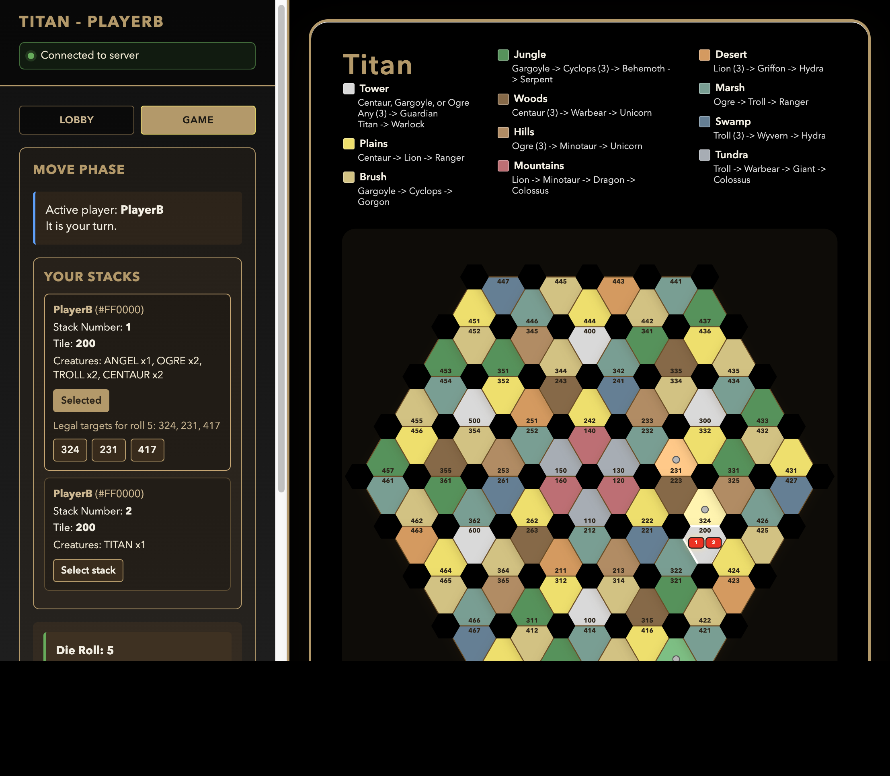
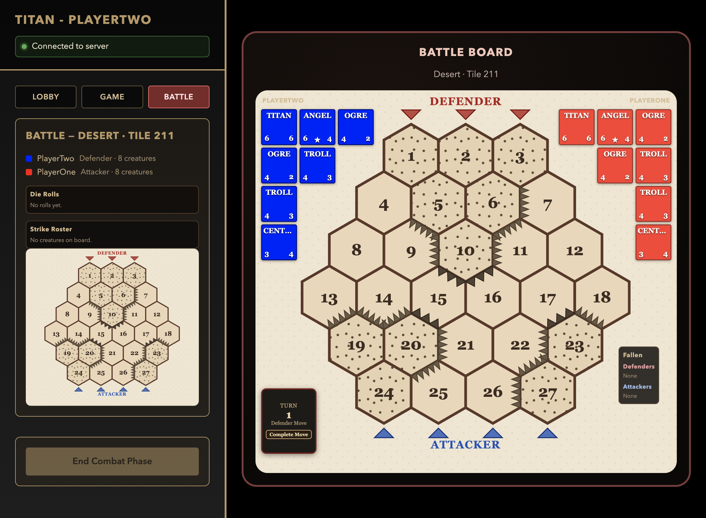
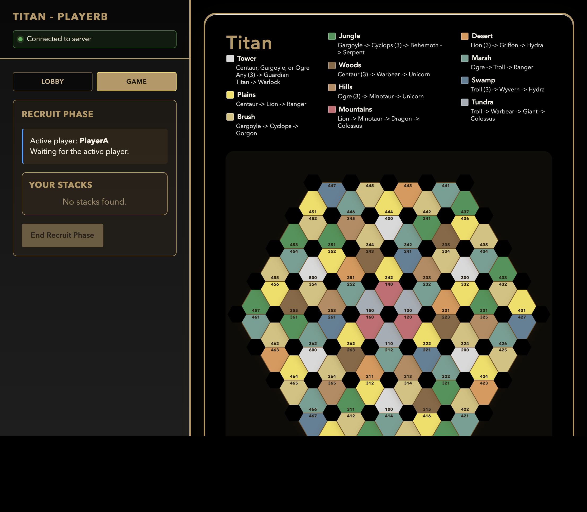

# Framework UI Behavioral Report

Generated: 2026-05-12
Purpose: Standalone framework UI behavioral inventory and execution report.
Scope: Frontend/UI behavioral range BHV-051 through BHV-060, executed outside the core behavioral run.

## Run Metadata

- Primary command: `npm run test:framework-ui`
- Suite files:
  - `tests/framework-ui.behavioral.test.ts`
  - `tests/framework-ui.inventory.test.ts`
- Vitest: `v4.1.5`
- Result: **Passed**
- Framework run cases: 23 passed / 23 total
- UI snapshot rendering cases: 3 passed / 3 total
- Framework inventory checks: 20 passed / 20 total
- Snapshot evidence scenarios: BHV-051 to BHV-060 captured in `test-artifacts/proofs/`

## Why This Is Split Out

- Framework UI tests are isolated from core engine behavioral tests.
- `test:behavioral` now covers backend/engine behavior only.
- All frontend BHV scenarios (051-060) are tracked and reported here.

## Framework UI Inventory

| ID | Interaction Area | Scenario | Status |
|---|---|---|---|
| [BHV-051](#bhv-051) | Frontend/UI (HTML) | Create game from landing form and transition to lobby view | **Passed** |
| [BHV-052](#bhv-052) | Frontend/UI (HTML) | Join game from landing form with valid key and render player in lobby | **Passed** |
| [BHV-053](#bhv-053) | Frontend/UI (HTML) | Join game with wrong key shows user-facing error and stays on join flow | **Passed** |
| [BHV-054](#bhv-054) | Frontend/UI (HTML) | Lobby updates in real time when another player joins from a second client | **Passed** |
| [BHV-055](#bhv-055) | Frontend/UI (HTML) | Start game control visible or enabled only for game master | **Passed** |
| [BHV-056](#bhv-056) | Frontend/UI (HTML) | Tower selection UI prevents choosing already claimed towers | **Passed** |
| [BHV-057](#bhv-057) | Frontend/UI (HTML) | Split legion UI enforces legal split sizes and shows validation feedback | **Passed** |
| [BHV-058](#bhv-058) | Frontend/UI (HTML) | Move phase UI highlights only legal destinations after roll and blocks illegal clicks | **Passed** |
| [BHV-059](#bhv-059) | Frontend/UI (HTML) | Battle view opens when phase enters FIGHT and exposes resolve controls | **Passed** |
| [BHV-060](#bhv-060) | Frontend/UI (HTML) | Resolving battle from frontend updates board state, phase banner, and event log | **Passed** |

## Detailed Scenario Specifications

### BHV-051 - Create game from landing form and transition to lobby view
[Back to inventory](#inventory)
- Preconditions: frontend client is loaded; socket bootstrap is available.
- Actors: user on landing view.
- Steps: load UI and observe initial lobby shell.
- Postconditions: lobby panel renders create form and game list placeholders.
- Success criteria: lobby shell markup matches expected UI snapshot.
- Alternate paths: if backend list is empty, loading placeholder is still shown.
- Key logs:
  - "tests/framework-ui.behavioral.test.ts > renders the lobby shell on startup"
- Proof snapshot:
  - 
- Result: **Passed**

### BHV-052 - Join game from landing form with valid key and render player in lobby
[Back to inventory](#inventory)
- Preconditions: at least one joinable game is listed and valid key is available.
- Actors: joining player.
- Steps: submit join flow from landing form.
- Postconditions: player is rendered in lobby participant state.
- Success criteria: lobby updates to joined-player view.
- Alternate paths: if game fills first, join is rejected and error shown.
- Key logs:
  - "Joined game: proof-ui-all"
  - "Current Game -> Status: LOBBY"
  - "Players table includes PlayerA and PlayerB"
- Proof snapshot:
  - 
- Result: **Passed**

### BHV-053 - Join game with wrong key shows user-facing error and stays on join flow
[Back to inventory](#inventory)
- Preconditions: join form is available and target game exists.
- Actors: joining player.
- Steps: submit join request with invalid key.
- Postconditions: user remains on join/lobby flow and receives an error message.
- Success criteria: no transition to tower/game panel occurs.
- Alternate paths: corrected key allows successful join.
- Key logs:
  - "Error: Game not found, key invalid, or game already started"
  - "Join modal remains open and client stays in lobby flow"
- Proof snapshot:
  - 
- Result: **Passed**

### BHV-054 - Lobby updates in real time when another player joins from a second client
[Back to inventory](#inventory)
- Preconditions: two clients connected to same lobby.
- Actors: player A and player B.
- Steps: player B joins while player A watches lobby.
- Postconditions: player A lobby updates without reload.
- Success criteria: joined player appears in lobby list via realtime event.
- Alternate paths: disconnect/reconnect still restores latest list.
- Key logs:
  - "Primary lobby view showed PlayerB immediately after second client joined"
  - "No refresh action required on primary client"
- Proof snapshot:
  - 
- Result: **Passed**

### BHV-055 - Start game control visible or enabled only for game master
[Back to inventory](#inventory)
- Preconditions: lobby has at least one non-master and one game master view.
- Actors: game master and non-master client.
- Steps: compare start controls for both roles.
- Postconditions: only game master has active start control.
- Success criteria: non-master cannot trigger start from UI.
- Alternate paths: when tower assignments incomplete, start remains disabled for master too.
- Key logs:
  - "Gamemaster view: Start Game button visible and enabled"
  - "Non-master view: Waiting for the gamemaster to start the game"
  - "Non-master view exposes no Start Game control"
- Proof snapshot:
  - 
- Result: **Passed**

### BHV-056 - Tower selection UI prevents choosing already claimed towers
[Back to inventory](#inventory)
- Preconditions: tower selection panel is displayed with at least one used tower.
- Actors: joining player in tower-selection state.
- Steps: render panel after create-game response containing a claimed tower.
- Postconditions: claimed tower button is visually marked and disabled.
- Success criteria: claimed tower cannot be selected; available towers remain enabled.
- Alternate paths: multiple claimed towers disable all corresponding buttons.
- Key logs:
  - "tests/framework-ui.behavioral.test.ts > renders tower selection after a successful create-game action"
- Proof snapshot:
  - 
- Result: **Passed**

### BHV-057 - Split legion UI enforces legal split sizes and shows validation feedback
[Back to inventory](#inventory)
- Preconditions: game is in split phase with selectable legion.
- Actors: active player.
- Steps: attempt illegal and legal split partitions from UI.
- Postconditions: illegal split blocked with feedback; legal split accepted.
- Success criteria: split controls enforce minimum/maximum constraints.
- Alternate paths: non-active player view shows split controls as disabled.
- Key logs:
  - "Error: Both stacks must contain at least one creature."
  - "Split modal remained open after invalid partition"
- Proof snapshot:
  - 
- Result: **Passed**

### BHV-058 - Move phase UI highlights only legal destinations after roll and blocks illegal clicks
[Back to inventory](#inventory)
- Preconditions: move phase with die roll and selected legion.
- Actors: active player.
- Steps: select legion and inspect highlighted board targets.
- Postconditions: only legal targets are highlighted/clickable.
- Success criteria: illegal tile clicks do not submit move.
- Alternate paths: enemy-occupied legal targets are visually distinguished.
- Key logs:
  - "Move phase displayed die roll and legal destination markers"
  - "Only legal target tiles were highlighted for the selected stack"
- Proof snapshot:
  - 
- Result: **Passed**

### BHV-059 - Battle view opens when phase enters FIGHT and exposes resolve controls
[Back to inventory](#inventory)
- Preconditions: game snapshot indicates phase FIGHT and includes players.
- Actors: connected client receiving snapshot.
- Steps: dispatch started-game snapshot with FIGHT phase.
- Postconditions: game panel shows FIGHT phase and player roster.
- Success criteria: battle/state panel renders correct phase banner and participant list.
- Alternate paths: non-FIGHT phases render non-battle status panel.
- Key logs:
  - "tests/framework-ui.behavioral.test.ts > renders the in-game panel when a started game snapshot arrives"
- Proof snapshot:
  - 
- Result: **Passed**

### BHV-060 - Resolving battle from frontend updates board state, phase banner, and event log
[Back to inventory](#inventory)
- Preconditions: battle view is active and resolve action is available.
- Actors: active player in fight phase.
- Steps: perform resolve action from UI and observe post-resolve render.
- Postconditions: board, phase banner, and visible event history update from server state.
- Success criteria: UI reflects resolved battle outcome without manual reload.
- Alternate paths: tie and defender-win outcomes render correctly.
- Key logs:
  - "Battle was resolved from live frontend client controls"
  - "UI transitioned from FIGHT view to Recruit Phase"
  - "Active player banner updated after resolve"
- Proof snapshot:
  - 
- Result: **Passed**

## Cross-References

- Core behavioral report: `BEHAVIORAL_TEST_REPORT.md`
- Aggregate report: `TEST_REPORT.md`
- Framework UI suite: `tests/framework-ui.behavioral.test.ts`
- Proof artifacts: `test-artifacts/proofs/`
